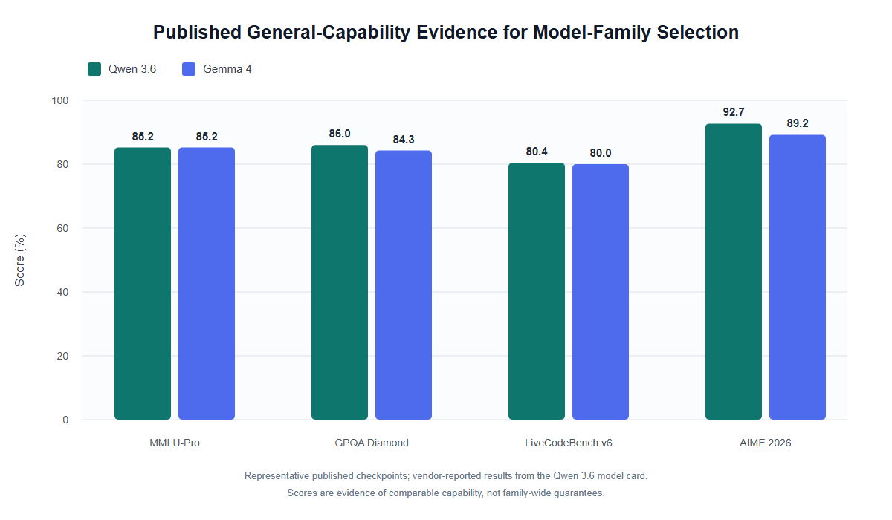

# Qwen 3.6 与 Gemma 4 模型家族选择依据

> 检索日期：2026-09-01。以下内容按“可直接写入论文的正文—证据边界—参考来源”组织。

## 可直接写入论文的版本

### 模型家族选择

本研究选择 Qwen 3.6 与 Gemma 4 作为主要模型家族，依据并非它们在某个已有因果关系抽取排行榜上的直接优势，而是二者同时满足本研究对基础模型的四项要求：较强的语言理解与推理能力、对受控输出格式的支持、可本地部署和微调，以及覆盖不同参数规模和计算预算的公开权重。因果关系抽取不仅要求模型识别事件之间的语义依赖，还要求其准确定位原因与结果的文本边界，并按照固定 schema 返回结构化结果。因此，通用知识与推理基准只能反映完成该任务所需的部分能力，模型对指令和输出 schema 的遵循能力同样重要。

Qwen 3.6 的官方模型卡将其定位为面向稳定性和实际应用的开放权重模型，并提供 Transformers、vLLM、SGLang 和 KTransformers 等推理框架支持。该系列公开模型使用 Apache 2.0 许可证，便于在统一的本地推理环境中控制 prompt、解码参数与 RAG 条件。Qwen 3.6 的官方说明还建议在评测中通过 JSON 结构标准化输出，这与本研究要求模型生成固定字段的因果三元组相契合。需要说明的是，截至检索日期，Qwen 3.6 尚未检索到独立的学术技术报告；因此，本研究仅使用 Qwen3 Technical Report 说明其模型家族的技术脉络，而将 Qwen 3.6 的具体架构、上下文长度和公开成绩归于其官方发布说明与模型卡。

Gemma 4 则具有正式的技术报告。报告将其描述为开放权重、原生多模态的模型家族，覆盖 dense 与 mixture-of-experts 架构，并强调推理、长上下文和计算效率。其官方模型卡进一步给出可配置 thinking mode、原生 system role 和 function calling 支持。对本研究而言，原生 system role 有助于稳定放置抽取规则，function calling 与受控角色结构则表明该模型家族面向结构化、可控输出进行了明确设计。Gemma 4 同样采用 Apache 2.0 许可证，并提供从低资源本地运行到较大规模推理的多种公开权重，适合比较模型规模与微调策略对抽取性能的影响。

公开通用基准也表明两个模型家族均具备较强的任务基础能力。Qwen 3.6 官方模型卡在同一张表中报告了代表性 Qwen 3.6 与 Gemma 4 模型的结果：二者在 MMLU-Pro 上均为 85.2；在 GPQA Diamond 上分别为 86.0 与 84.3；在 LiveCodeBench v6 上分别为 80.4 与 80.0；在 AIME 2026 上分别为 92.7 与 89.2。由于这些是厂商公开结果，而且对应特定 checkpoint，本文不据此断言某一模型家族整体优于另一家族；这些结果仅说明二者处于相近且较强的通用能力区间，因而适合作为后续因果抽取实验的基础模型。



**图注建议：** Qwen 3.6 与 Gemma 4 代表性公开 checkpoint 的通用基准结果。数据来自 Qwen 3.6 官方模型卡中的同表比较。图中分数是具体 checkpoint 的厂商公开结果，不代表模型家族所有规模的性能。

与本研究最接近的外部证据来自 ExtractBench。该公开基准评估模型依据用户定义的 schema 从文档中抽取值并生成结构化结果，包含 370 份文档、4,869 页、8 个业务领域和 67 种文档类型，并使用顺序无关的 value F1 评估抽取准确性。Hugging Face 公开评测记录显示，一个 Qwen 3.6 checkpoint 在 one-shot `json_object` 设置下取得 88.11 的平均分；一个较小的 Gemma 4 checkpoint 在对应设置下取得 69.64。两项结果并非参数规模严格匹配的对照实验，因此不宜用于比较两个家族的高低，但能够证明两个家族都已有在 schema-guided structured extraction 场景中成功运行的公开证据。尤其是，ExtractBench 与本研究都要求模型识别文本中的目标信息并遵循预定输出结构，因此它比数学或知识问答榜单更接近本研究的输出约束。

综上，Qwen 3.6 与 Gemma 4 的选择应被表述为一种兼顾能力、可控性、开放性与实验互补性的研究设计。两个模型家族来自不同研发机构，且在架构和效率取向上有所差异；同时纳入二者可以降低实验结论依赖单一厂商、单一模型实现或单一规模的风险。现有公开证据足以支持它们作为因果关系抽取候选基础模型，但不能替代本文在 CNC、Li、ADE 和 CauseNet 数据集上的任务内评测。

## 建议保留的证据边界

- 不写“Qwen 3.6 或 Gemma 4 已被证明擅长因果关系抽取”，因为目前未找到针对二者的直接因果抽取公开榜单。
- 可写“二者在通用推理基准上表现较强，并有公开的 schema-guided structured extraction 结果”。
- 通用基准图使用的是相近规模的代表性 checkpoint，但正文的研究对象仍可概括为模型家族。
- ExtractBench 的两个公开分数并非同规模对照，只用于证明任务适配性，不用于断言家族间优劣。
- Qwen3 Technical Report 是 Qwen 3.6 的技术脉络来源，不是 Qwen 3.6 的独立技术报告；Qwen 3.6 的具体信息应引用官方模型卡或发布博客。

## 核心来源及用途

1. [Qwen 3.6 官方模型卡](https://huggingface.co/Qwen/Qwen3.6-35B-A3B)：开放许可、部署框架、架构说明、上下文长度、官方基准及 ExtractBench 记录。
2. [Qwen 3.6 官方发布博客](https://qwen.ai/blog?id=qwen3.6-35b-a3b)：Qwen 3.6 的正式发布说明；在没有独立技术报告时作为版本级来源。
3. [Qwen3 Technical Report](https://arxiv.org/abs/2505.09388)：只用于说明 Qwen3 家族的 unified thinking/non-thinking、效率、多语言与开放许可等技术脉络。
4. [Gemma 4 Technical Report](https://arxiv.org/abs/2607.02770)：Gemma 4 的正式技术报告，支持开放权重、dense/MoE、thinking、长上下文与效率等表述。
5. [Gemma 4 官方模型卡](https://huggingface.co/google/gemma-4-31B-it)：许可、模型规模、system role、function calling、部署方式与官方基准。
6. [Gemma 4 公开 ExtractBench 评测记录](https://huggingface.co/google/gemma-4-E4B-it)：Gemma 4 在 schema-guided structured extraction 上的公开结果。
7. [ExtractBench 论文](https://arxiv.org/abs/2607.29677)与[公开数据集/排行榜](https://huggingface.co/datasets/llamaindex/ExtractBench)：说明 benchmark 的任务定义、数据规模与 value F1 指标。
8. [ExtractBench 公开 pipeline 列表](https://github.com/run-llama/ExtractBench/blob/main/docs/pipelines.md)：核对 Qwen 3.6 与 Gemma 4 均使用自托管 vLLM 和 `json_object` 结构化输出流程。

## BibTeX 草稿

```bibtex
@misc{qwen36_2026,
  author       = {{Qwen Team}},
  title        = {{Qwen3.6-35B-A3B}: Agentic Coding Power, Now Open to All},
  year         = {2026},
  month        = apr,
  howpublished = {Qwen official release and Hugging Face model card},
  url          = {https://qwen.ai/blog?id=qwen3.6-35b-a3b}
}

@article{yang2025qwen3,
  title         = {Qwen3 Technical Report},
  author        = {Yang, An and Li, Anfeng and Yang, Baosong and others},
  year          = {2025},
  eprint        = {2505.09388},
  archivePrefix = {arXiv},
  primaryClass  = {cs.CL},
  url           = {https://arxiv.org/abs/2505.09388}
}

@article{gemmateam2026gemma4,
  title         = {Gemma 4 Technical Report},
  author        = {{Gemma Team}},
  year          = {2026},
  eprint        = {2607.02770},
  archivePrefix = {arXiv},
  primaryClass  = {cs.CL},
  url           = {https://arxiv.org/abs/2607.02770}
}

@article{zhang2026extractbench,
  title         = {ExtractBench: A Benchmark for Schema-Guided Enterprise Document Extraction},
  author        = {Zhang, Boyang and Lyjak, Adrian and Stewart, Eli and Li, Zhaoqi and Suo, Simon},
  year          = {2026},
  eprint        = {2607.29677},
  archivePrefix = {arXiv},
  primaryClass  = {cs.AI},
  url           = {https://arxiv.org/abs/2607.29677}
}
```
